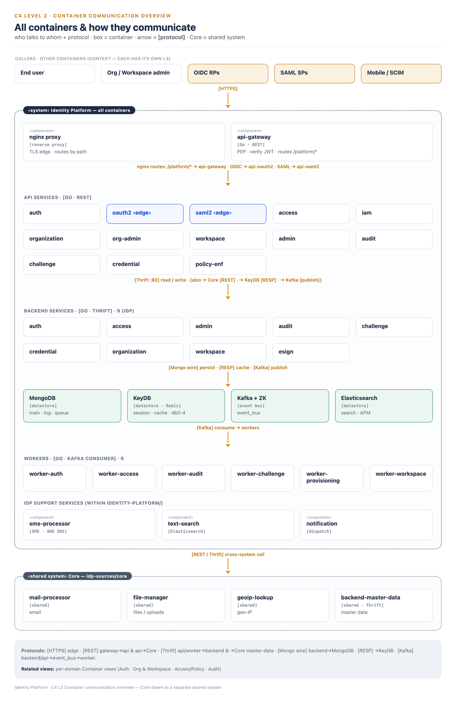
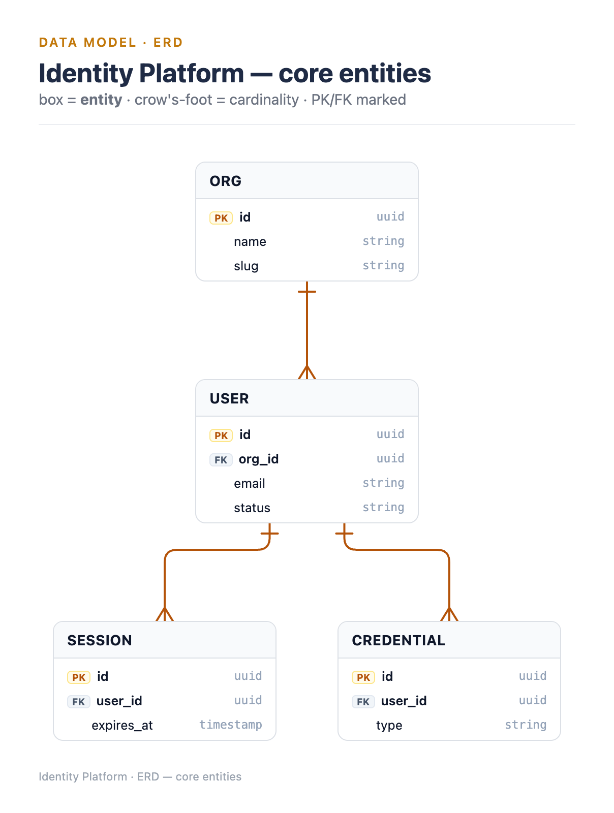
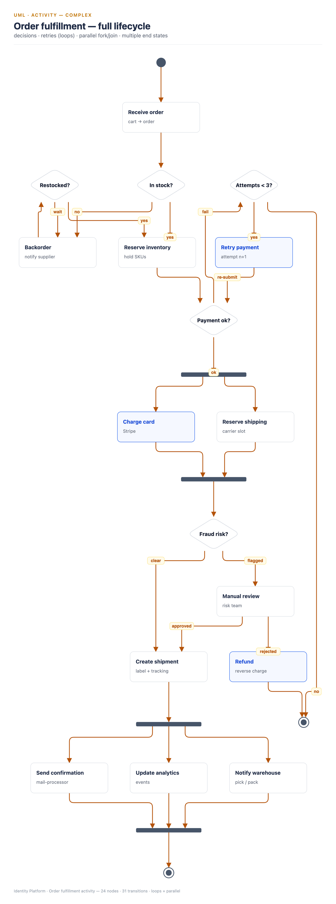
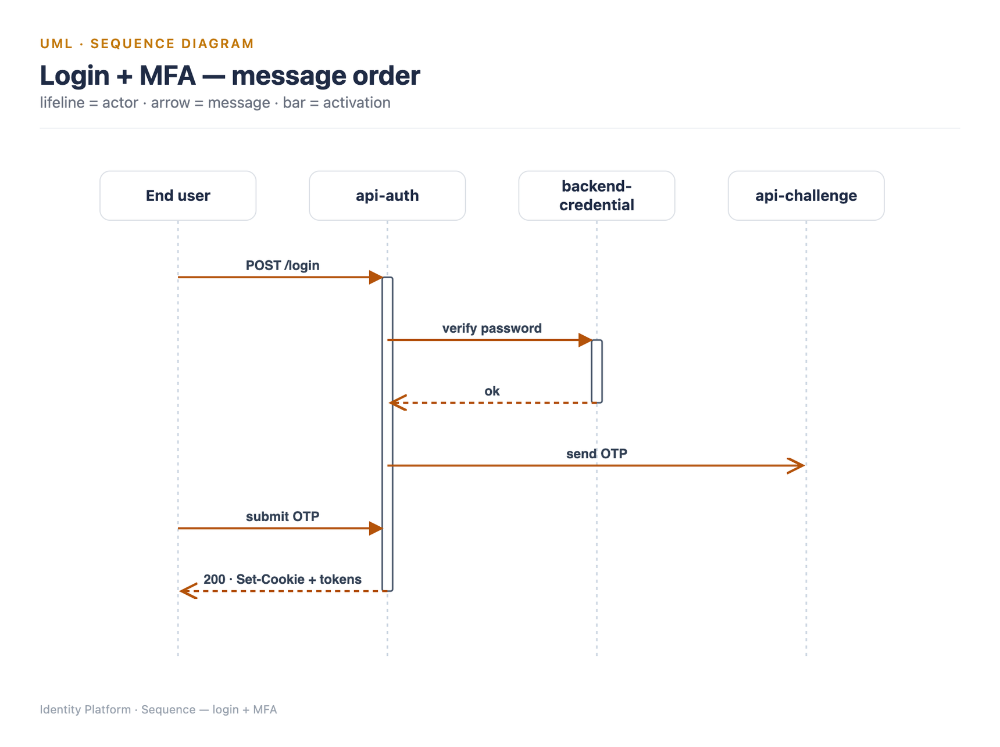
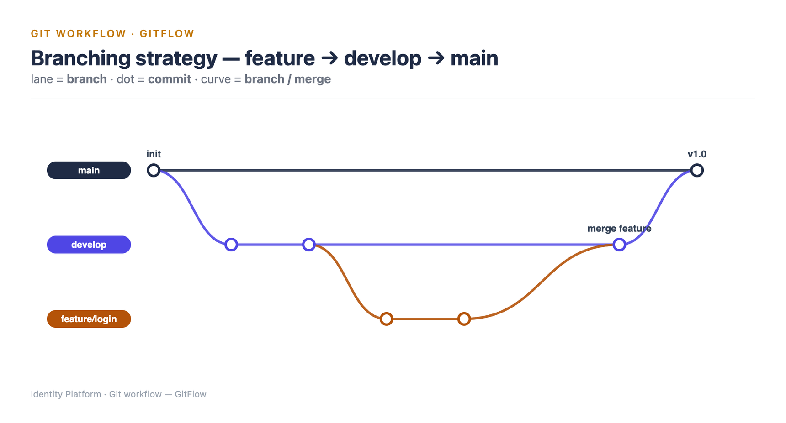
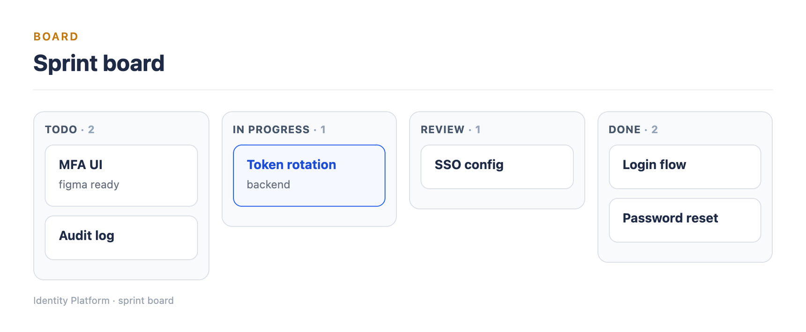

# Editorial Diagrams

A Claude Code plugin that turns plain requests into **clean, consistent, editorial‑style
diagrams** — architecture (C4), UML, ERD, flowcharts, sequence, git workflows, gantt and
more — rendered to **PNG / PDF / SVG**. You describe what you want in chat; Claude writes a
compact spec and the plugin renders a polished image, all in one house style.

> 30+ diagram types · 5 layout engines · one consistent look · balanced auto‑layout.

## Install

In Claude Code, run:

```
/plugin marketplace add vophitruonganh/editorial-diagrams
/plugin install editorial-diagrams
```

That's it. On first use you'll briefly see *"installing dependencies (one time)…"* — the
plugin sets itself up automatically. To update later: `/plugin marketplace update editorial-diagrams`.

**Requirements:** Node.js + npm available on your machine, and a Chrome/Edge browser
(the plugin downloads a renderer automatically if none is found).

## How to use

Just ask Claude in natural language — the `editorial-diagrams` skill activates automatically:

- *"Draw a C4 container diagram of this system."*
- *"Make an ERD of the users / orders / sessions tables."*
- *"Sequence diagram for the login + MFA flow."*
- *"Flowchart of the checkout process with the retry and error paths."*
- *"GitFlow branching diagram for our release process."*

Claude writes the spec, renders it, saves the image to disk, and shows you a preview — then
you can ask for tweaks (*"make the payment branch red", "split this into two diagrams"*) and
it re‑renders.

## Features

- **One consistent editorial style** for every diagram — same cards, palette, and typography.
- **30+ diagram types** across 5 engines (below).
- **PNG · PDF · SVG** output; transparent background and resolution options.
- **Balanced, professional auto‑layout** (ELK) — centered, symmetric, no overlapping edges.
- **Token‑efficient** — compact spec instead of hand‑written HTML, downscaled inline previews,
  reusable scaffolds and examples; full‑resolution files always saved to disk.
- **You don't learn a DSL** — Claude authors the spec for you.

## Supported diagrams

| Family | Types |
|---|---|
| **C4 / architecture** | System Context (L1) · Container (L2) · Component (L3) · Code (L4) · Dynamic · Deployment · System Landscape · Layered · Data‑flow (DFD) · Pipeline |
| **UML & graphs** | Flowchart · Activity · State machine · Class · Sequence · Communication · ERD · Dependency / call graph · Network · Mind map · Org chart · Decision tree · Knowledge graph · Data lineage |
| **Workflow & time** | Git workflow (trunk / GitFlow) · Timeline / roadmap · Gantt · User journey |
| **Grid & board** | Matrix · Quadrant (2×2) · Kanban · Swimlane |

## Gallery

Real output from the plugin:

| | |
|---|---|
| **C4 — Container view**<br> | **ERD — crow's‑foot**<br> |
| **UML Activity**<br> | **UML Sequence**<br> |
| **Git workflow (GitFlow)**<br> | **Kanban board**<br> |

## Output formats & options

- `format`: `png` (default) · `pdf` (true vector) · `svg`
- `return_image`: `auto` (full‑res file on disk + a downscaled inline preview) · `full` · `none` · `link`
- `preview_width`, `scale`, `width`, `transparent` — all optional.

The on‑disk file is always full quality; only the inline preview is downsized (for token efficiency).

## Privacy & trust

The plugin runs locally and renders with a local browser — your diagram content never leaves
your machine. As with any plugin, review the source before installing.
